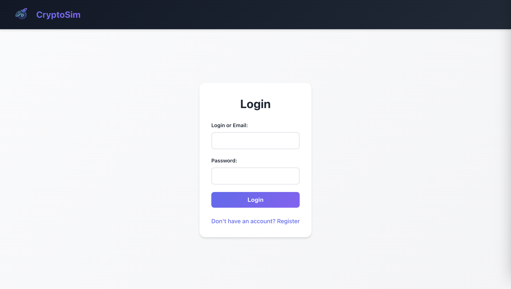
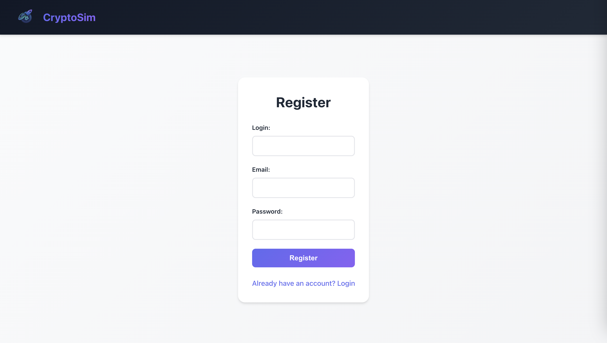
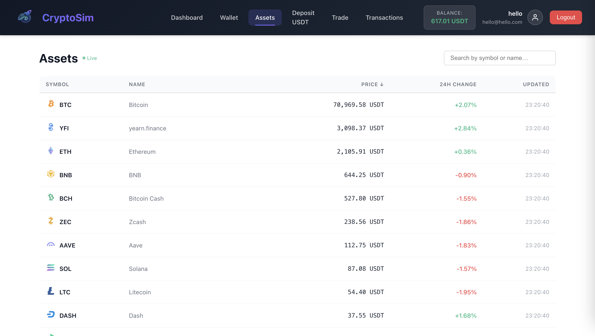
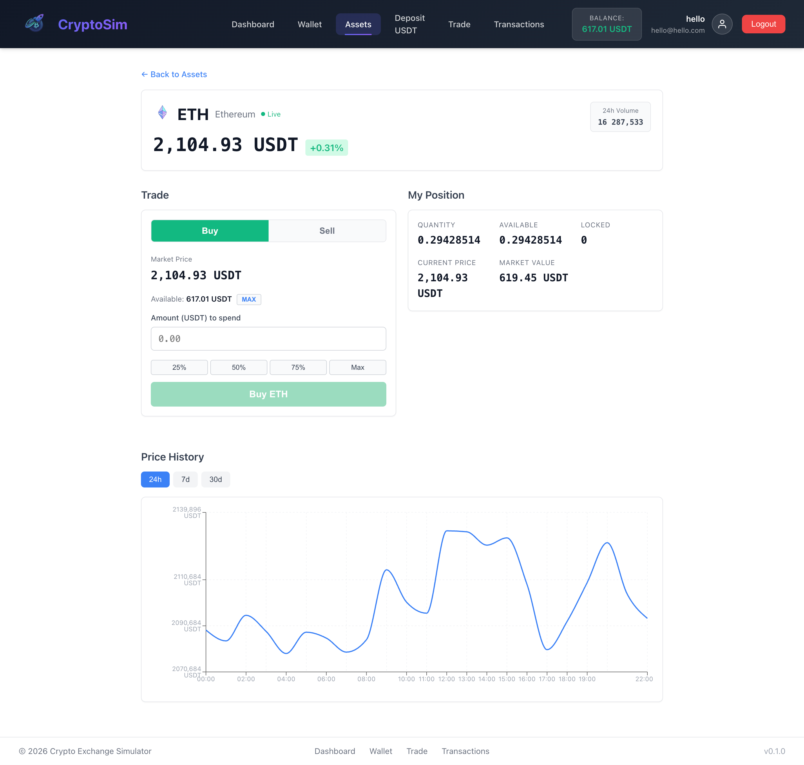
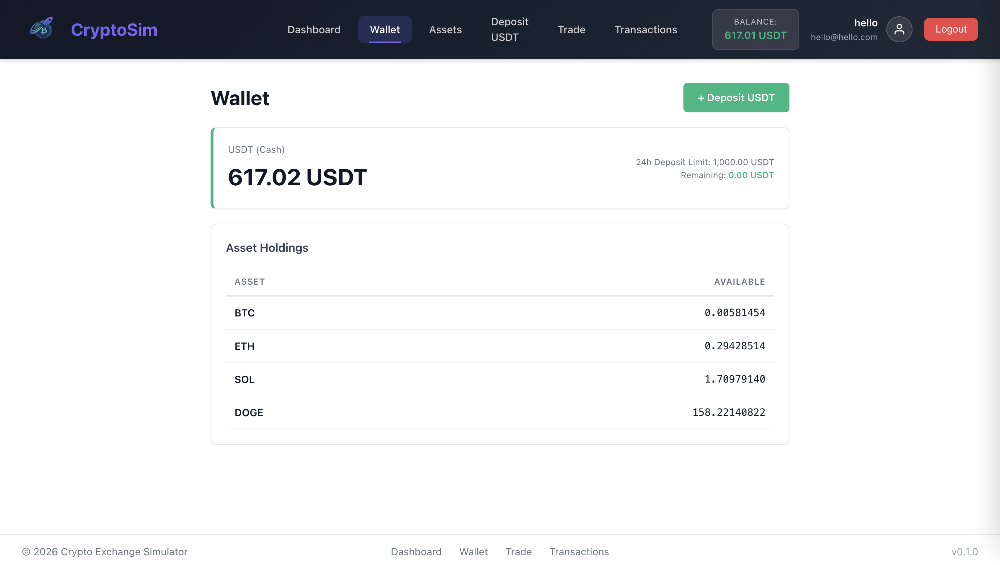
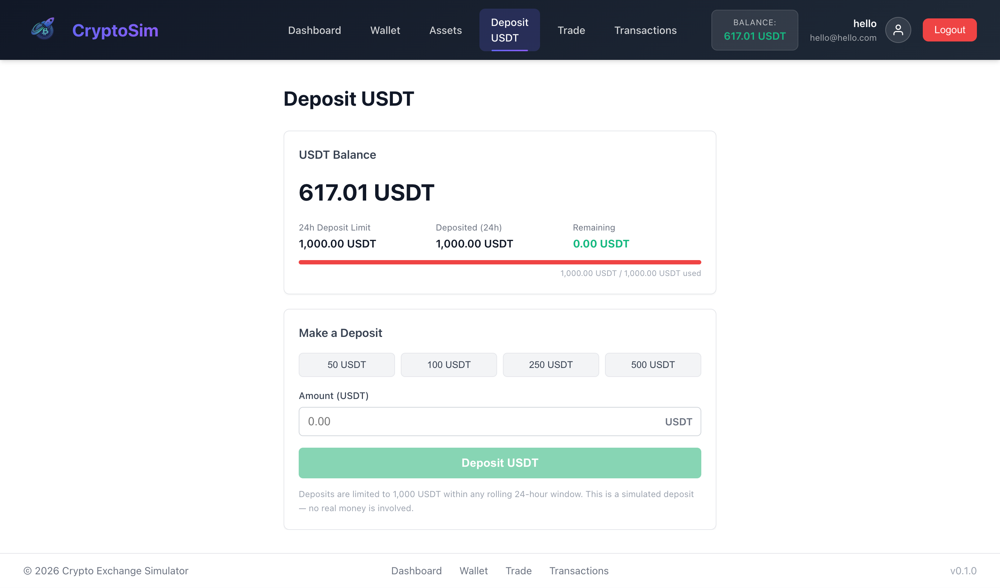
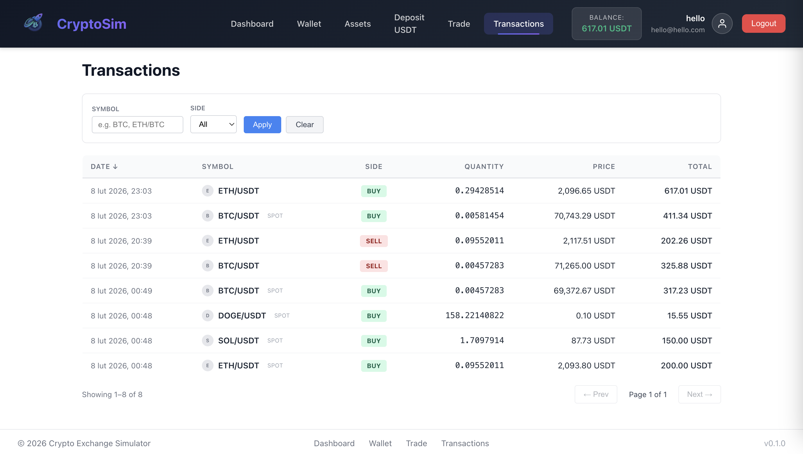
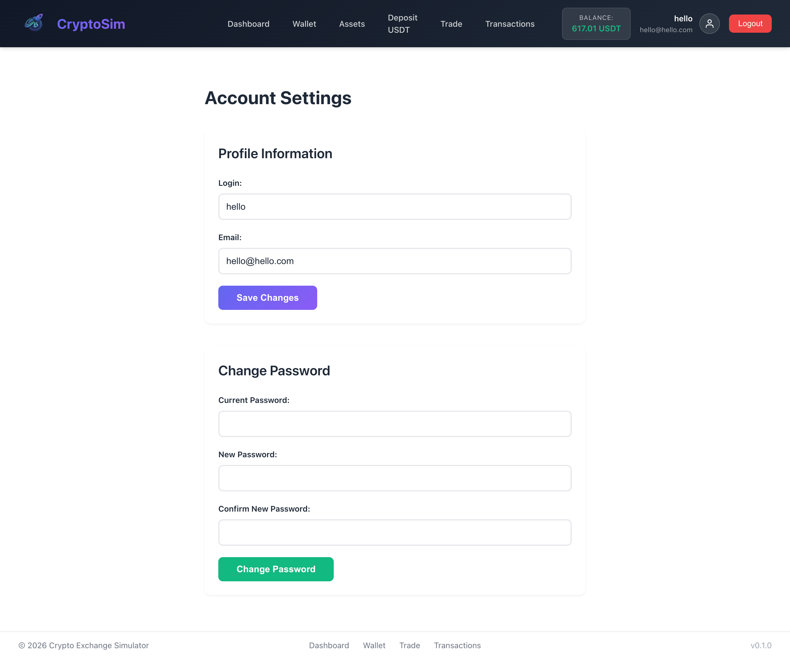

# Crypto Exchange

A full-stack cryptocurrency exchange platform built with Spring Boot, React, PostgreSQL, Redis, Kafka. Users can register, deposit USDT, browse live-priced crypto assets, execute market orders, and track their portfolio — all powered by real-time price data from external exchanges (WhiteBit).

---

## Key Features

- **JWT Authentication** — registration, login, profile management, and password change with stateless token-based security (BCrypt + JJWT).
- **Portfolio Dashboard** — aggregated portfolio value, per-asset holdings with live USD prices, and profit/loss tracking.
- **Wallet and Deposits** — multi-asset balance management with USDT cash deposits subject to a rolling 24-hour limit.
- **Asset Catalog** — browse 100+ seeded crypto assets with live prices, 24h change, search, sorting, and pagination.
- **Asset Detail View** — price charts (24h / 7d / 30d), market statistics (high, low, volume), and the user's current position.
- **Market Orders** — execute spot BUY/SELL orders at live market prices fetched from WhiteBit.
- **Transaction History** — unified, filterable view of all transactions and trades with pagination.
- **Real-Time Price Stream** — Server-Sent Events (SSE) endpoint broadcasting live price updates to connected clients.
- **Rate Limiting** — Redis-backed per-user rate limits on order placement, deposits, and withdrawals.
- **Health Monitoring** — Spring Boot Actuator integration with custom system health endpoint reporting API, database, Redis, and Kafka status.
- **API Documentation** — interactive Swagger UI auto-generated from annotated controllers via SpringDoc OpenAPI.

---

## Screenshots

### Login



### Registration



### Dashboard


### Assets



### Asset Detail



### Trading


### Wallet



### Deposit



### Transactions



### Account Settings



---

## Tech Stack

| Layer            | Technology                                                                 |
|------------------|----------------------------------------------------------------------------|
| **Backend**      | Java 21, Spring Boot 4, Spring Security, Spring Data JPA, Spring Kafka  |
| **Frontend**     | React 19, Vite, React Router, Axios, Recharts                         |
| **Database**     | PostgreSQL with Flyway migrations                                       |
| **Cache**        | Redis (caching, rate limiting)                                           |
| **Messaging**    | Apache Kafka with Zookeeper                               |
| **Auth**         | JWT + BCrypt                                                |
| **API Docs**     | SpringDoc OpenAPI (Swagger UI)                                      |
| **Build**        | Maven (backend), npm (frontend), Docker, Make                              |
| **CI/CD**        | Jenkins (Declarative Pipeline), Makefile                                   |
| **Testing**      | JUnit, Mockito, Testcontainers (PostgreSQL, Kafka), H2, ESLint          |

---

## Architecture

```
                  +------------------+
                  |   React SPA      |  (Vite dev server :5173)
                  |   (frontend/)    |
                  +--------+---------+
                           |  HTTP / SSE
                           v
                  +------------------+
                  | Spring Boot API  |  (:8080)
                  |   (backend/)     |
                  +--+------+-----+--+
                     |      |     |
            +--------+  +---+  +--+--------+
            |           |      |           |
      +-----v----+  +---v---+  +---v----+  |
      |PostgreSQL|  | Redis |  | Kafka  |  | External APIs
      |  :5432   |  | :6379 |  | :9092  |  +---> WhiteBit
      +---------+   +-------+  +--------+
```

- The **React frontend** communicates with the backend over REST (`/api/**`) and subscribes to live price updates via SSE (`/api/stream/prices`).
- The **Spring Boot backend** persists data in PostgreSQL, uses Redis for caching and rate limiting, and publishes domain events (order created, trade executed) to Kafka topics.
- **Live market prices** are fetched from WhiteBit (on-demand via REST). Scheduled periodic fetch stored as price ticks.
- **Flyway** manages all database schema changes through versioned SQL migrations.
- In production, **Nginx** acts as a reverse proxy, serving the frontend static build and forwarding `/api/` and `/actuator/` requests to the backend.

---

## Repository Structure

```
crypto-exchange-sim/
|-- backend/                    # Spring Boot application
|   |-- src/main/java/          #   Controllers, services, models, config
|   |-- src/main/resources/     #   application.yml profiles, Flyway migrations
|   |-- src/test/               #   Unit and integration tests
|   |-- Dockerfile              #   Multi-stage Docker build
|   +-- pom.xml                 #   Maven project descriptor
|-- frontend/                   # React SPA
|   |-- src/
|   |   |-- app/                #   App shell, router
|   |   |-- pages/              #   Page components (Dashboard, Wallet, Trading, etc.)
|   |   +-- shared/             #   API clients, context, hooks, components
|   |-- Dockerfile              #   Multi-stage build (Node -> Nginx)
|   +-- package.json
|-- devops/jenkins/             # Jenkins CI server (Dockerfile + docker-compose)
|-- docker-compose.yml          # Development infrastructure (Postgres, Redis, Kafka)
|-- Jenkinsfile                 # Declarative CI pipeline
+-- Makefile                    # Developer convenience targets
```

---

## Getting Started (Local Development)

### Prerequisites

| Tool           | Purpose                                         |
|----------------|-------------------------------------------------|
| Java           | Backend compilation and runtime                 |
| Maven          | Backend build (wrapper included: `./mvnw`)      |
| Node.js        | Frontend build and development server           |
| npm            | Frontend dependency management                  |
| Docker         | Infrastructure containers                       |
| Docker Compose | Orchestrating Postgres, Redis, Kafka            |

### Configuration

Create a `.env` file in the project root for Docker Compose and the backend:

```env
# PostgreSQL
POSTGRES_DB=crypto_exchange
POSTGRES_USER=postgres
POSTGRES_PASSWORD=<your-password>

# Spring datasource (used by the backend)
SPRING_DATASOURCE_URL=jdbc:postgresql://localhost:5432/crypto_exchange
SPRING_DATASOURCE_USERNAME=postgres
SPRING_DATASOURCE_PASSWORD=<your-password>

# Redis
REDIS_HOST=localhost
REDIS_PORT=6379

# Kafka
KAFKA_BOOTSTRAP_SERVERS=localhost:9092

# JWT
JWT_SECRET=<your-256-bit-secret-minimum-32-characters>
JWT_EXPIRATION=86400000

# CORS (frontend dev server)
CORS_ALLOWED_ORIGINS=http://localhost:5173

# Price fetcher
PRICE_FETCHER_INTERVAL_MS=30000

# Rate limits (requests per window)
RATE_LIMIT_ORDERS=30
RATE_LIMIT_ORDERS_WINDOW=60s
RATE_LIMIT_WALLET_DEPOSIT=10
RATE_LIMIT_WALLET_DEPOSIT_WINDOW=60s
RATE_LIMIT_WALLET_WITHDRAW=5
RATE_LIMIT_WALLET_WITHDRAW_WINDOW=60s
```

> The backend loads `.env` automatically via its `DotenvConfig` class. No additional tooling is required.

### Run Infrastructure

Start PostgreSQL, Redis, Kafka, and Zookeeper:

```bash
docker compose up -d
```

Verify all containers are running:

```bash
docker compose ps
```

### Run Backend

```bash
cd backend
./mvnw spring-boot:run
```

The backend starts on **http://localhost:8080** with the `dev` profile active by default.

### Run Frontend

```bash
cd frontend
npm install
npm run dev
```

The Vite dev server starts on **http://localhost:5173** and proxies `/api` and `/actuator` requests to the backend automatically.

---

## API Documentation

Interactive API documentation is available via Swagger UI when the backend is running:

| Resource    | URL                                              |
|-------------|--------------------------------------------------|
| Swagger UI  | http://localhost:8080/swagger-ui.html             |
| OpenAPI JSON| http://localhost:8080/v3/api-docs                 |

The Swagger UI supports JWT Bearer authentication — paste a token obtained from `/api/auth/login` into the Authorize dialog to test authenticated endpoints.

---

## Health Checks / Observability

### Spring Boot Actuator

```bash
curl http://localhost:8080/actuator/health
```

Returns component-level health for the database, Redis, and Kafka. In the `dev` profile, detailed health information is shown.

Exposed actuator endpoints: `health`, `info`.

### Custom System Health

```bash
curl http://localhost:8080/api/system/health
```

Returns a simplified JSON status object:

```json
{
  "status": {
    "api": "OK",
    "db": "OK",
    "redis": "OK",
    "kafka": "OK"
  }
}
```

This endpoint is public (no authentication required) and is used by the frontend dashboard.

---

## Testing

### Backend

Unit and integration tests use JUnit 5, Mockito, and Testcontainers (PostgreSQL, Kafka). An H2 in-memory database is available for lightweight tests.

```bash
cd backend
./mvnw clean test
```

### Frontend

Lint the frontend codebase:

```bash
cd frontend
npm run lint
```

---

## CI/CD

### Jenkins Pipeline

The project includes a declarative `Jenkinsfile` with the following stages:

1. **Backend: Test** — runs `./mvnw clean test` and archives JUnit results.
2. **Backend: Package** — builds the JAR (`./mvnw -DskipTests package`) and archives the artifact.
3. **Frontend: Install** — installs npm dependencies (`npm ci`).
4. **Frontend: Lint** — runs ESLint.
5. **Frontend: Build** — builds the production bundle and archives `dist/`.
6. **Docker Build** (conditional, parallel) — builds `crypto-backend` and `crypto-frontend` Docker images if Docker is available on the agent.

### Running Jenkins Locally

A self-contained Jenkins server is provided in `devops/jenkins/`:

```bash
make jenkins-up
```

Jenkins is accessible at **http://localhost:8081**. Retrieve the initial admin password:

```bash
make jenkins-password
```

Stop Jenkins:

```bash
make jenkins-down
```